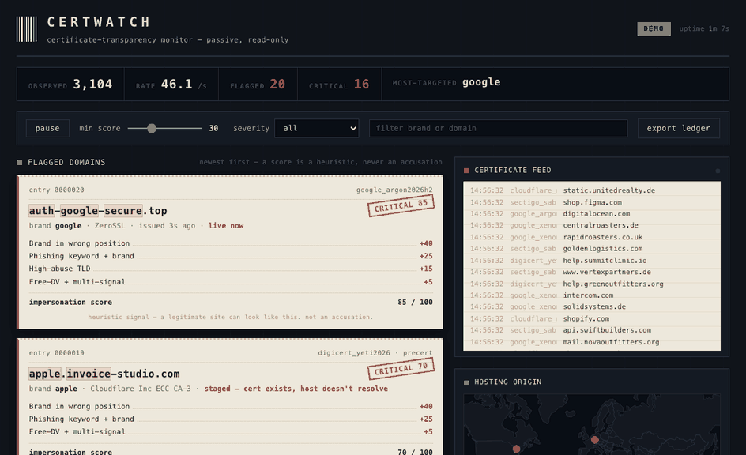

# CertWatch

**A live feed of domains that were born minutes ago and probably exist to steal someone's credentials.**



<sub>Demo mode running offline — synthetic certificate stream. The receipt on the left prints a flagged domain the moment it appears; the tape on the right is the raw certificate firehose.</sub>

---

## What is this?

Every time a website turns on HTTPS, the Certificate Authority that issued its certificate is **required** to publish that certificate to public, append-only **Certificate Transparency (CT)** logs. Browsers enforce this: Chrome rejects any certificate it can't find in a CT log. The side effect is remarkable — there is a public, worldwide, real-time feed of essentially every domain that turns on HTTPS, usually within seconds of it happening.

Attackers need HTTPS too. A phishing page without a padlock converts badly. So when someone registers `paypa1-secure-login.com` and points Let's Encrypt at it, that domain shows up in the public CT firehose **before the phishing campaign launches**.

CertWatch taps that firehose, scores every domain for impersonation and phishing intent against a watchlist of brands, and surfaces the hits live.

```bash
git clone <this-repo> && cd CertWatch
python -m venv .venv && source .venv/bin/activate
pip install -r requirements.txt
python run.py                 # offline demo — opens the dashboard
python run.py --live          # poll real CT logs
```

No API keys. No database. No root. No cloud account. `python run.py` produces a live dashboard within ~10 seconds on a machine with no network at all.

---

## Certificate Transparency in three sentences

1. When a Certificate Authority issues an HTTPS certificate, it must log that certificate to public append-only ledgers called Certificate Transparency logs, and modern browsers reject certificates that aren't logged.
2. Those logs are readable by anyone, with no authentication, so they form a real-time public stream of nearly every domain on earth the moment it enables HTTPS.
3. Because phishing sites use HTTPS as well, their domains appear in that stream too — often while the campaign is still being staged — which is exactly what CertWatch watches for.

---

## How it works

```
CT logs / demo ──▶ queue ──▶ scorer ──▶ dedupe ──▶ ring buffer ──▶ Socket.IO ──▶ dashboard
  (source)                  (signals)    (TTL)      (in-memory)      (sampled)
                                │
                                └─▶ enrichment (DNS + geo, async, best-effort)
```

- **Sources** (`certwatch/sources/`) — a synthetic generator for the offline demo, a direct RFC 6962 CT log poller for real data, an optional CertStream websocket client, and a JSONL replayer.
- **Detection** (`certwatch/detect/`) — the scoring engine, homoglyph/confusable tables, DGA entropy heuristics, and the brand watchlist with allowlisting and hot-reload.
- **Enrichment** (`certwatch/enrich.py`) — resolves flagged domains and geolocates their hosting, asynchronously, on a bounded thread pool that can never stall ingest.
- **Server** (`certwatch/server.py`) — Flask + Flask-SocketIO. Alerts emit immediately; the raw cert stream is sampled and batched so no browser drowns.

---

## Detection signals

Every unique registrable domain is scored once, capped at 100. A registrable domain that **is** brand-owned short-circuits to zero — the allowlist always wins.

| # | Signal | What it catches | Points |
|---|--------|-----------------|--------|
| 1 | **Brand lookalike** | Registrable label within Damerau-Levenshtein distance 1–2 of a brand (or its real login domain), e.g. `paypa1.com`, `microsoft0nline.com` | +45 (d=1) / +30 (d=2) |
| 2 | **Brand in wrong position** | Brand token in a subdomain or hyphenated component of a non-brand domain, e.g. `paypal.account-verify.com`, `login-paypal.co` | +40 |
| 3 | **Homoglyph substitution** | Domain folds onto a brand after applying a confusables table (`0↔o`, `1↔l`, `rn↔m`, Cyrillic/Greek lookalikes), e.g. `rnicrosoft.com`, `pаypal.com` | +40 |
| 4 | **Punycode present** | Any `xn--` label; more if it decodes toward a brand | +25 / +35 |
| 5 | **Phishing keyword + brand** | A lure term (`login`, `verify`, `secure`, `wallet`…) alongside a brand | +25 |
| 6 | **Phishing keyword alone** | A lure term with no brand | +10 |
| 7 | **High-abuse TLD** | Configurable list: `.zip .mov .top .tk .cf .gq .ml .click .rest .cam .quest .sbs .xyz` … | +15 |
| 8 | **DGA-like label** | High Shannon entropy, low dictionary coverage, long consonant runs, e.g. `x7fj29dkq2.com` | +15 |
| 9 | **SAN sprawl** | >30 SANs on one cert, or SANs spanning many unrelated registrable domains | +10 |
| 10 | **Free-DV + multi-signal** | A DV cert from a free issuer **when at least two other signals already fired** | +5 |

**Signal 10 is the guardrail:** "issued by Let's Encrypt" is never a signal on its own. Most of the honest web uses free DV certificates. A detector that flagged that would flag the entire internet.

Severity bands: **Critical 70+ · High 50–69 · Medium 30–49 · Low <30.** The feed shows ≥30 by default; the slider reveals everything.

### Suppression

Precision is the whole game. CertWatch:

- keeps a per-brand **allowlist** of legitimate domains and CDN/vendor patterns (`paypal.com`, `paypalobjects.com`, `*.paypal.co.uk` never fire);
- **short-circuits** the moment a registrable domain is recognised as brand-owned;
- **dedupes** renewals with a TTL cache so a domain alerts once per run and shows a repeat count instead;
- length-guards fuzzy matching so short brand tokens (`ups`, `dhl`) can't collide with unrelated words.

The bundled scoring test suite is table-driven and roughly half negatives, so it pins false-positive behaviour as hard as it pins detection.

---

## The brand watchlist

`brands.json` ships with a sensible default set (major banks, PayPal, Microsoft/Office 365, Google, Apple, Amazon, Meta, Netflix, DHL/FedEx/USPS, Coinbase/Binance/MetaMask, Okta, DocuSign, and more) and is fully user-editable. It is **hot-reloaded** — edit it while CertWatch runs and the change takes effect within a second.

```json
{
  "paypal": {
    "tokens": ["paypal", "pypl"],
    "legitimate": ["paypal.com", "paypalobjects.com", "paypal.me"],
    "weight": 1.0
  }
}
```

`weight` multiplies the brand-dependent signals so you can prioritise the brands you actually care about.

---

## CLI

```
python run.py [OPTIONS]
  (no flags)          Demo mode — simulated CT stream, works offline
  --live              Poll real Certificate Transparency logs
  --certstream URL    Use a CertStream-compatible websocket instead of polling
  --logs TEXT         Comma-separated CT log names to follow (default: auto-select 3)
  --brands PATH       Path to brands.json (default: ./brands.json)
  --min-score INT     Minimum score to record as an alert (default: 30)
  --record PATH       Append all alerts to a JSONL file
  --replay PATH       Replay a recorded JSONL at original timing
  --replay-speed N    Replay speed multiplier (default: 1.0)
  --seed INT          Seed the demo generator for a reproducible run
  --rate FLOAT        Demo certs/sec (default: 25)
  --no-geo            Disable IP geolocation lookups
  --host TEXT         Bind host (default: 127.0.0.1)
  --port INT          Port (default: 8765)
  --no-browser        Don't auto-open the dashboard
```

**Record and replay** are the best way to build a demo: capture a genuinely interesting hour of real traffic, then replay it deterministically.

```bash
python run.py --live --record capture.jsonl       # capture real hits
python run.py --replay capture.jsonl               # replay them, same timing
```

---

## Design

The dashboard is grounded in the subject's own vernacular. CT logs are **append-only ledgers** — a receipt roll that never stops printing, monotonic sequence numbers, entries that can never be edited or removed. So the interface is a dark ops console; the raw certificate feed is a pale **thermal tape**; and every flagged domain prints as a **paper receipt slip** that gets a red rubber **stamp**. All of the visual boldness is spent on one moment — the stamp thumping down when an alert fires — and everything around it stays quiet, which is what makes that moment read from across a room. It respects `prefers-reduced-motion` (the tape stops animating and stays legible), has visible keyboard focus, is responsive to mobile, and never shifts layout when alerts arrive.

---

## Testing

```bash
pip install pytest
python -m pytest tests/ -q
```

- `test_parse.py` parses **real** CT entries captured from public logs, including an `entry_type == 1` **precertificate** — the case you must parse out of `extra_data` rather than the leaf. Roughly half of all CT entries are precerts; mishandling them silently drops half the live feed.
- `test_score.py` is a ~70-case table, roughly half of it legitimate/near-miss traffic that must **not** fire, so precision is tested as hard as recall.

---

## Safety and ethics

- CertWatch reads **public** data. CT logs exist precisely so that anyone can audit certificate issuance. Nothing here is circumvented and there is no gray area.
- CertWatch is **entirely passive**. It never resolves-and-fetches a flagged domain, never port-scans, never probes. The single outbound touch is a DNS lookup for enrichment — a lookup, not a visit.
- A high score is a **heuristic signal, not an accusation**. False positives are guaranteed: a legitimate company can absolutely register `secure-login-acme.com`. The UI says so, right next to every score.
- CertWatch does **not** do automated reporting, publishing, or takedown submission. It flags and it explains. What you do next is your call, and it should involve a human.

---

## License

MIT.
